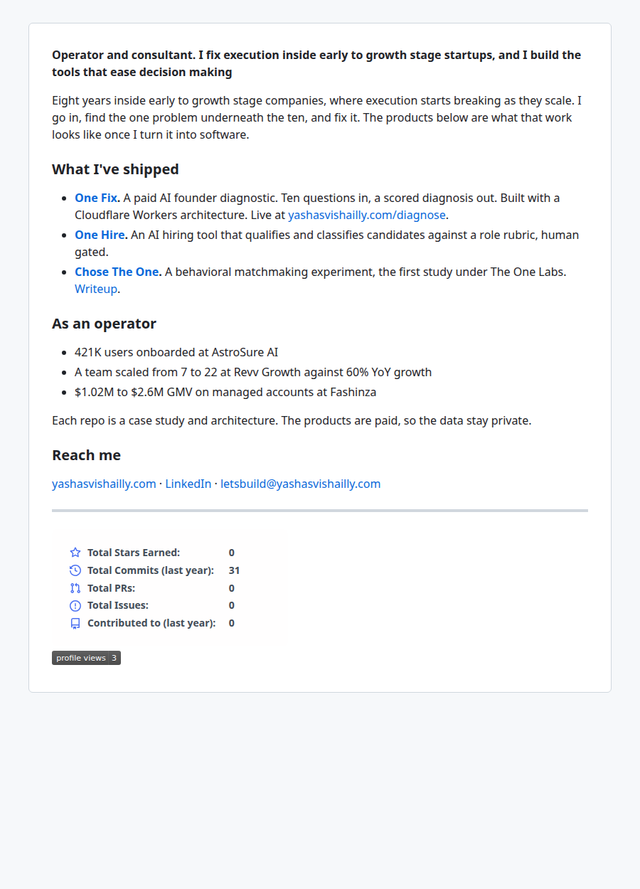

# Visual Product Diary

A dated, visual record of changes to my public-facing products and this profile. Newest entries first. Each entry captures what changed, why, and a screenshot of the result at the time.

---

## 001 — Profile stats section · 2026-09-08

**What changed.** Added a stats footer to the profile README: a GitHub activity card (stars, commits, PRs, issues, contributions) with light/dark variants, and a profile views counter. Placed below the Reach me section so it doesn't compete with the operator numbers up top.

**Decisions worth recording.**

- The popular hosted card at `github-readme-stats.vercel.app` is effectively dead — Vercel ended its sponsorship and the public deployment returns `503 DEPLOYMENT_PAUSED`. Community mirrors serve error cards.
- Instead of depending on third-party hosting, the cards are generated inside this repo by a scheduled GitHub Action (`.github/workflows/update-stats.yml`, runs daily) using the maintainers' recommended [github-readme-stats-action](https://github.com/stats-organization/github-readme-stats-action). The README embeds the committed SVGs from `profile/`, so nothing on the profile can break when someone else's server goes down.
- Skipped trophies and streak widgets deliberately — they read as hobbyist and would dilute the consultant/operator positioning.

**Result.**

